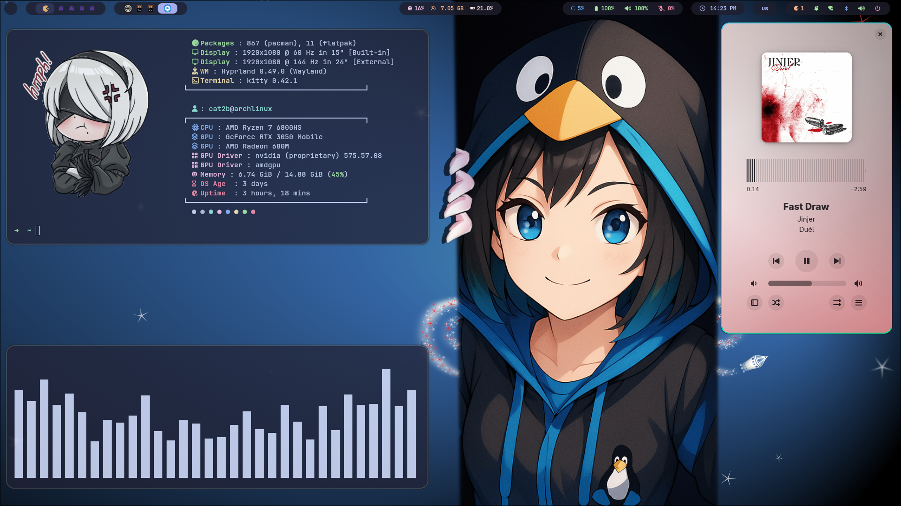
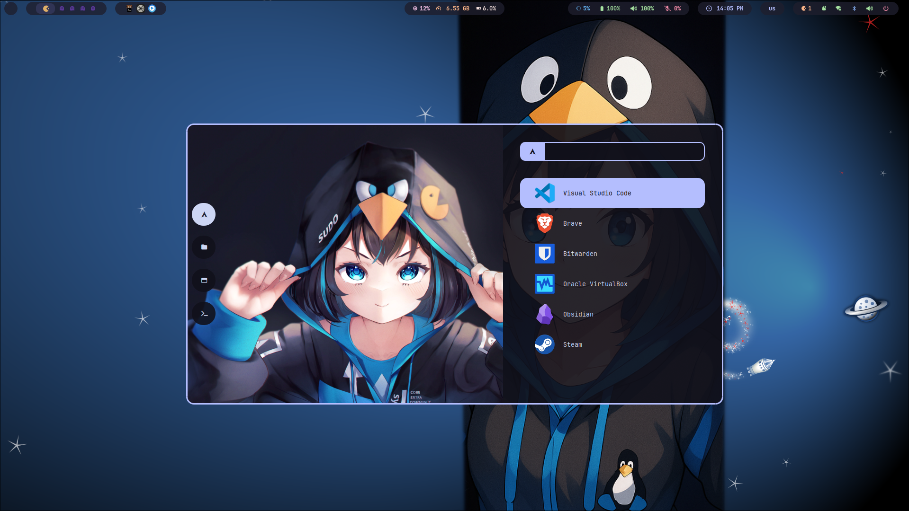

<!-- INFORMATION -->
My dotfiles

<h1 align="left">About</h1>


</br>

 - OS: **`Arch Linux`**
 - WM: **`Hyprland`**
 - Bar: **`Waybar`**
 - Terminal: **`Kitty`**
 - App Launcher: **`Rofi`**
 - Shell: **`Zsh`**

</br>


<!-- IMAGES -->
## SCREENSHOTS






<!-- HOTKEYS -->
## HotKeys
* **Open the terminal** - `super + enter`
* **Close active window** - `super + q`
* **Open file manager** - `super + e`
* **Open the application menu** - `super + space`
* **Open browser** - `super + b`
* **Lock the screen** - `super + l`
* **Take a screenshot** - `print`
* **Take a screenshot area** - `super + shift + p`
* **Switch to another workspace** - `super + [0-9]`
* **Move focus within workspace** - `super + [←, ↑, →, ↓]`
* **Toggle floating** - `super + v`
* **Switch on/off waybar** - `super + shift + b`

The other hotkeys are in `~/.config/hypr/keybidings.conf`.

<!-- INSTALLATION -->
## Installation

```bash
git clone https://github.com/JavBC11/dotfiles.git && cd dotfiles
```

```bash
chmod +x install.sh
```

```bash
./install.sh
```
## In case of failure
you can install the necessary packages and move the dotfiles to your .config directory.
```bash
sudo pacman -Syu --noconfirm
```

```bash
sudo pacman -S --noconfirm bat blueman brightnessctl cava dunst fastfetch feh flatpak git htop hyprland hyprlock hyprpaper kitty lsd nautilus nwg-look neovim pamixer papirus-icon-theme pavucontrol python-pip python-distutils-extra qt5-wayland qt6-wayland rofi-wayland ttf-font-awesome ttf-jetbrains-mono ttf-jetbrains-mono-nerd wget waybar xdg-desktop-portal-hyprland xdg-utils yazi zsh zsh-autosuggestions zsh-syntax-highlighting
```

```bash
pip install psutil gputil pyamdgpuinfo inquirer loguru pyyaml colorama --break-system-packages
```
yay installation
```bash
sudo pacman -S --noconfirm --needed git base-devel && git clone https://aur.archlinux.org/yay.git && cd yay && makepkg -si
```
installation package with yay
```bash
yay -S --noconfirm hyprshot bibata-cursor-git catppuccin-gtk-theme-mocha
```
finally, copy the configurations

```bash
dirs=(dunst fastfetch gtk-3.0 gtk-4.0 hypr kitty waybar nvim rofi)

for dir in "${dirs[@]}"; do
    mkdir -p "$HOME/.config/$dir"
    cp -r "$HOME/dotfiles/.config/$dir/"* "$HOME/.config/$dir/"
done
```

## Waybar was taken from user Meowrch

Git repo of Meowrch:

* [Meowrch](https://github.com/meowrch/meowrch)


